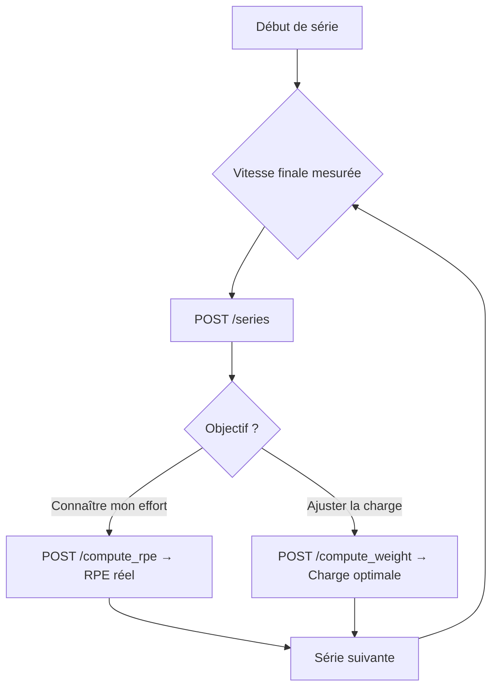

# Parcours d'un athlète

Bartrack s'intègre naturellement dans ta séance d'entraînement. Voici comment les différentes briques s'articulent, de la première connexion à l'évolution de ton profil athlétique.

---

## 1. Inscription et connexion

Tout commence par la création de ton profil. Bartrack a besoin de quelques informations de base pour personnaliser les calculs (poids de corps, sexe, âge) rien de superflu.

- **`POST /users/`** — Création du compte athlète avec les métriques corporelles.
- **`POST /login`** — Authentification qui retourne un `access_token` JWT à inclure dans chaque requête suivante.

---

## 2. Étalonnage du profil VBT

Avant de tirer profit de l'autorégulation, ton profil doit être initialisé. Cette étape établit la relation entre ta vitesse barre et ton niveau d'effort perçu.

- **`POST /rm1_users/`** — Renseigne ton 1RM actuel si tu le connais déjà.
- **`POST /initialize`** — Lance le calibrage scientifique, tu effectues deux montées à des RPE différents, et Bartrack calcule la droite *vitesse / RPE* propre à cet exercice.

!!! danger "Qualité des données"
    La précision de tout le système repose sur cette étape. Une vitesse mal mesurée (capteur mal placé, série bâclée) va fausser ton *slope* et ton *intercept* et donc toutes les recommandations qui suivront. Prends le temps de bien calibrer.

---

## 3. Planification de l'entraînement

Bartrack ne se limite pas au suivi en direct. Tu peux structurer tes blocs de force à l'avance.

- **`POST /exercices/`** — Ajoute n'importe quel mouvement à ta bibliothèque (Squat, Deadlift, Bench, etc.).
- **`POST /programmes/full`** — Crée un programme complet en une seule requête, ordre des exercices, nombre de séries, répétitions et RPE cible pour chaque bloc.

---

## 4. Le jour J

À la salle, tu ouvres l'app et tu démarres ta session. Chaque exercice est lié à la séance du jour pour garder un historique propre.

- **`POST /seances/`** — Crée la séance du jour (horodatée automatiquement).
- **`POST /seance_exos/`** — Attache l'exercice que tu vas faire à cette séance (ex : Squat).
- **`POST /daily_1rm/`** — Après ta première montée en charge, l'app évalue ton 1RM du jour à partir de la vitesse mesurée. Ton niveau réel ce jour-là pas celui d'il y a 3 semaines.

---

## 5. Séries et autorégulation en temps réel

C'est ici que Bartrack prend tout son sens. Le capteur transmet la vitesse finale après chaque série, et l'app te dit quoi faire ensuite.

- **`POST /series/`** — Enregistre la série avec charge, répétitions et vitesse finale mesurée.
- **`POST /compute_rpe`** — Calcule le RPE réel que tu venais de produire à partir de ta vitesse.
- **`POST /compute_weight`** — Recommande la charge exacte à utiliser pour atteindre ton RPE cible à la prochaine série.

!!! info "Le paramètre clé : `rpe_cible`"
    En renseignant un `rpe_cible` dans ton programme, Bartrack calcule automatiquement la charge à mettre sur la barre pour atteindre exactement ce niveau d'effort — sans que tu aies à tâtonner entre les séries.

---

## 6. L'évolution continue — Rolling VBT

Ton corps change. Ta force évolue. Le profil VBT de Bartrack évolue avec toi.

- **`POST /rolling_vbt`** — Cet algorithme analyse tes **30 dernières séances** pour recalculer les coefficients de régression linéaire (*slope / intercept*). Si tu es en période de progression ou de fatigue accumulée, la courbe s'adapte — et tes recommandations aussi.