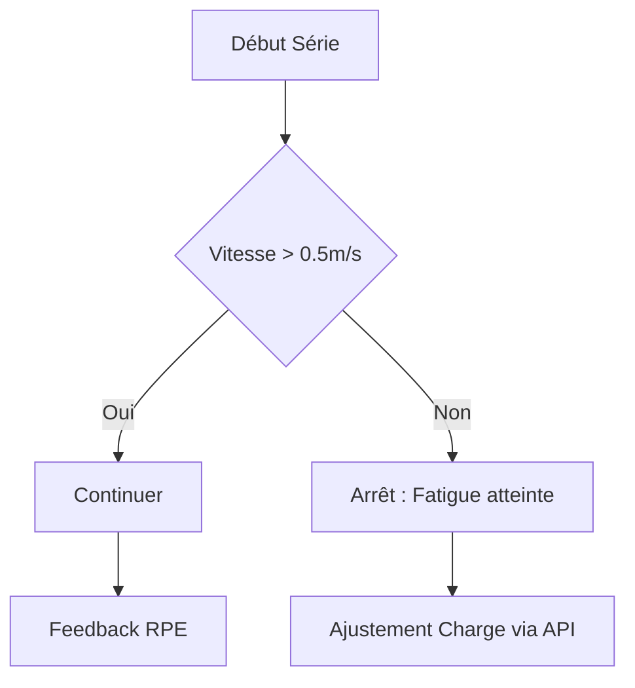

# Workflow Utilisateur

Ce document illustre le parcours logique d'un utilisateur au sein du système Bartrack au moment de son entraînement.

## 1. Inscription et Connexion
L'utilisateur s'inscrit puis s'authentifie pour récupérer son identité via Token.

- **`POST /users/`** : Inscription du nouvel athlète (âge, poids, etc).
- **`POST /login`** : Connexion pour obtenir un `access_token` valable sur toute l'API.

## 2. Initialisation du Profil (1RM & VBT)
Avant de s'entraîner, l'athlète s'étalonne sur différents exercices.

- **`POST /rm1_users/`** : Il renseigne un 1 RPE Max s'il le connaît.
- **`POST /initialize`** : Initialisation scientifique du profil.

!!! danger "Attention au capteur"
    Une vitesse finale mal calibrée faussera tout le profil VBT de l'athlète dans le calcul du *slope* et *intercept*. Prenez soin des données entrées !

## 3. Planification (Programmes)
L'utilisateur peut structurer son programme de force.

- **`POST /exercices/`** : Ajouter de la variété en créant de nouveaux mouvements de musculation.
- **`POST /programmes/full`** : Création massive d'un programme structuré qui inclue l'ordre de passage, de séries, répétitions requises et le RPE cible.

## 4. La Séance d'Entraînement
À la salle, l'athlète démarre l'application.

- **`POST /seances/`** : Création de la séance du jour avec sa date.
- **`POST /seance_exos/`** : On lie l'exercice (ex: Squat) qu'il s'apprête à faire à la séance.
- **`POST /daily_1rm/`** : Après sa première montée en charge, l'app évalue le `1RM` du jour basé sur sa vélocité de chauffe !

## 5. Séries et Autorégulation
Pendant l'effort, un capteur enregistre la donnée et met à jour Bartrack.

- **`POST /series/`** : Création d'une série avec la charge, les reps et la **Vitesse finale**.
- **`POST /compute_rpe`** ou **`POST /compute_weight`** : Grâce au VBT, Bartrack recommande le poids de la prochaine série, ou informe sur le niveau RPE réel qu'on vient de fournir.

!!! info "Astuce"
    Utilisez le paramètre `rpe_cible` du programme pour automatiquement réduire ou augmenter la charge de la série grâce au calcul VBT instantané.

## 6. L'Évolution avec le Rolling VBT
Après la séance, le profil de l'athlète ne reste pas figé.

- **`POST /rolling_vbt`** : L'algorithme tourne sur les 30 derniers jours de séries accomplies pour re-calculer les coefficients (Linear Regression). La courbe s'adapte à son changement de profil athlétique en continu !
